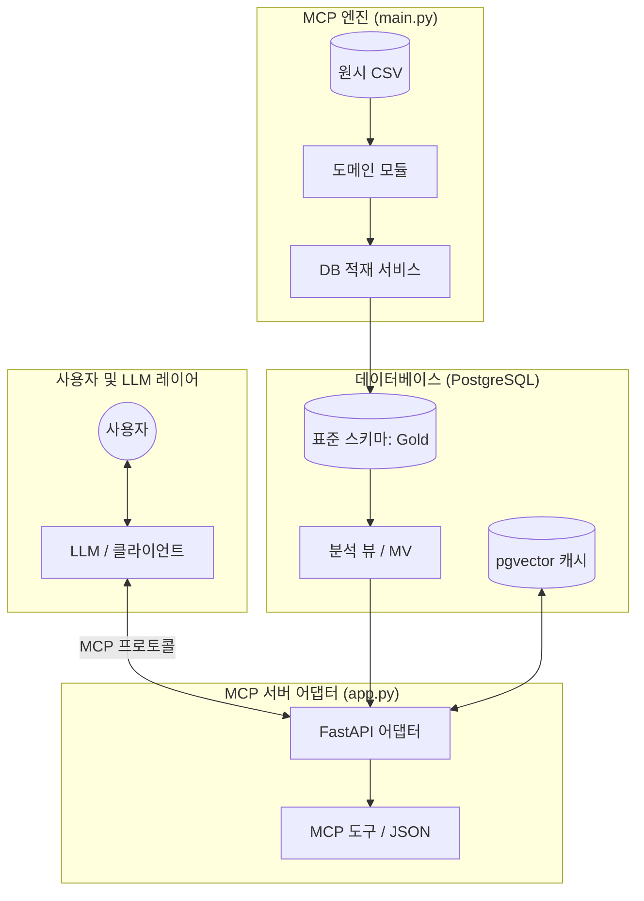

# MCP: 다중 도메인 데이터 비교 분석 플랫폼

도메인마다 상이한 스키마, 시간 단위, 지표 정의로 인해 데이터 분석 파이프라인이 중복 개발되는 문제를 해결하기 위한 프로젝트입니다. **도메인별 변환 로직과 코어 분석 엔진을 분리**하여 확장성을 극대화했으며, **Model Context Protocol(MCP)** 호환 API를 통해 LLM이 즉시 분석 결과를 소비할 수 있도록 설계되었습니다.

* **핵심 가치**: 이기종 데이터의 공통 스키마 정규화 및 LLM 친화적 시공간 분석 인사이트 제공

---

## 주요 기능

* **도메인 불가지론(Domain-Agnostic) 아키텍처**: 코어 수정 없이 모듈 확장만으로 신규 도메인 대응
* **표준 데이터 스키마**: `gold_activity`, `gold_demographics` 레이어로 데이터 통합 및 정규화
* **고급 인사이트 산출**: 데이터베이스 뷰 및 머티리얼라이즈드 뷰를 활용한 추세/이상/상관관계 지표 계산
* **LLM 최적화 출력**: 구조화된 JSON 응답을 통해 LLM의 도구 호출(Tool Calling) 지원
* **벡터 캐싱**: `pgvector`를 활용하여 유사 질의에 대한 매핑 및 응답 속도 최적화

---

## 설계 원칙

1. **확장 비용 최소화**: ETL과 지표 산출 로직을 분리하여 유지보수 효율성 제고
2. **데이터 재현성 보장**: 분석 로직을 DB 뷰로 고정하여 환경에 무관한 동일 결과 출력
3. **보안 및 통제**: LLM의 데이터베이스 직접 접근을 차단하고 MCP 어댑터를 통해서만 통신

---

## 아키텍처 및 데이터 흐름

### 시스템 구조도



### 데이터 파이프라인 (Medallion Architecture)


---

## 기술 스택

| 분류 | 기술 |
| --- | --- |
| **언어 및 프레임워크** | Python, FastAPI, Pandas |
| **데이터베이스** | PostgreSQL (pgvector 확장 포함) |
| **스토리지** | MinIO (S3 호환) |
| **인프라** | Docker, Docker Compose |

---

## 기술적 도전과 해결 방안

### 1. 데이터 시간 단위 정규화

* **문제**: 소스 데이터별로 상이한 시간 단위(월/일/시)로 인해 조인 분석 시 오차 발생
* **해결**: 적재 시 `_bucket_time_value` 함수를 통해 모든 지표를 표준 단위로 변환
* **결과**: 도메인에 관계없이 일관된 분석 뷰 구축 가능

### 2. 효율적인 대용량 데이터 처리

* **문제**: 대용량 CSV 처리 시 메모리 부족 및 중복 적재 발생
* **해결**: `CSVLoader`의 청크 처리와 `ingest_file_log`를 활용한 멱등성 확보
* **결과**: 자원 사용률 최적화 및 배치 작업의 안정성 확보

---

## 시작 가이드

### 1. 서비스 실행

```bash
docker-compose up --build -d

```

### 2. 데이터 적재 실행

```bash
docker-compose run --rm app python main.py

```

### 3. API 확인

* API 엔드포인트: `http://127.0.0.1:8000`
* 대화형 문서: `http://127.0.0.1:8000/docs`

---

## 프로젝트 구조

```text
.
├── app.py                  # API 서버 및 MCP 어댑터
├── main.py                 # 데이터 처리 배치 엔진
├── core/                   # 프레임워크 핵심 로직
├── domain/                 # 도메인별 변환 로직
├── services/               # DB 적재 및 LLM 연계 서비스
├── db/                     # SQL 스키마 및 분석 뷰 정의
└── data/                   # 입력 데이터 소스

```
