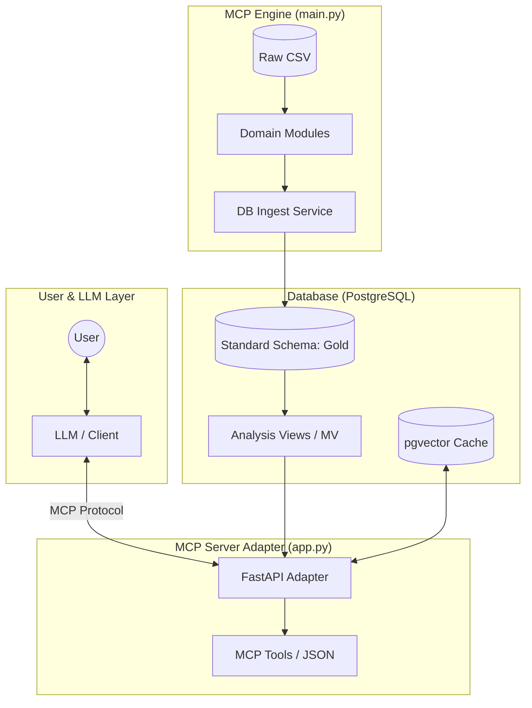
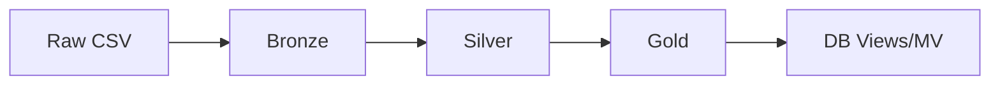

# MCP: Multi-domain Comparison Platform


도메인마다 다른 스키마/시간 단위/지표 정의 때문에 분석 파이프라인이 매번 다시 만들어지는 문제를 해결하기 위해,
MCP는 **도메인별 변환 로직과 코어 분석 엔진을 분리**한 데이터 분석 엔진으로 설계했습니다.
이 레포는 MCP 엔진과 Model Context Protocol(MCP) 호환 API 어댑터를 함께 제공하는 백엔드 프로젝트입니다.

한 줄 요약: **이기종 데이터를 공통 스키마로 정규화하고, 시공간 비교 인사이트를 LLM 친화적인 JSON으로 노출**합니다.

## ✨ Core Features

- **Domain-Agnostic 아키텍처**: 새 도메인이 추가되어도 Core는 수정하지 않고 모듈만 확장.
- **표준 스키마**: `gold_activity`, `gold_demographics`로 데이터 정규화.
- **인사이트 계산**: 뷰/머티리얼라이즈드 뷰에서 추세/이상/상관 지표 산출.
- **LLM-Ready 출력**: MCP Tool 형태의 API 응답으로 구조화된 JSON 제공.
- **벡터 캐시**: `pgvector` 기반의 질의 매핑 캐시 지원.

## 🧭 Why This Architecture

- **Core 수정 최소화**: 도메인별 ETL과 지표 산출을 분리해 확장 비용을 줄임.
- **DB 기반 재현성**: 분석 결과를 뷰로 고정하여 동일 조건에서 동일 출력 보장.
- **MCP 어댑터 분리**: LLM은 도구 호출만 수행하고, DB 직접 접근은 차단.

## 🏗️ Architecture Overview

- **MCP Engine** (`main.py`): 오프라인 배치 실행. CSV → 정규화 → `gold_*` 적재 → 뷰 갱신.
- **MCP Server Adapter** (`app.py`): FastAPI API. 쿼리 매핑/툴 호출/LLM 요약을 조합해 응답 생성.
- **Domain Modules** (`domain/`): 도메인별 raw → MCP 표준 변환.
- **Views/MV** (`db/init/*.sql`): 분석 지표 계산 레이어.

아키텍처 철학과 원칙은 `ARCHITECTURE.md`에 상세히 정리했습니다.

## 🧱 Architecture & Data Flow





## 🔁 Data Flow

1. CSV 수집 (`data/`)
2. 도메인 모듈에서 정규화 (`domain/`, `services/db_ingest.py`)
3. 표준 스키마 적재 (`gold_activity`, `gold_demographics`)
4. 분석 뷰 계산 (`v_activity_*`, `v_insight_candidate_*`)
5. API 응답 제공 (`app.py`, `tools/mcp_tools.py`)

## 🛠️ Tech Stack

- **Backend**: Python, FastAPI
- **Data Processing**: Pandas
- **Database**: PostgreSQL + pgvector
- **Object Storage**: MinIO (S3-compatible)
- **Orchestration**: Docker Compose

## 🚀 Getting Started

### Prerequisites

- Docker
- Docker Compose

### 1. Launch Services

```bash
docker-compose up --build -d
```

### 2. Run Data Ingestion

```bash
docker-compose run --rm app python main.py
```

`MCP_DB_DSN` 환경 변수는 `docker-compose.yml`에 이미 설정되어 있습니다.

### 3. Access the Application

`http://127.0.0.1:8000`  
API 문서: `http://127.0.0.1:8000/docs`

## 📥 Data Ingestion & Lake Layers

`main.py`는 CSV 원본을 읽어 표준 스키마(`gold_activity`, `gold_demographics`)로 적재합니다.
옵션으로 데이터 레이크 레이어를 함께 저장할 수 있습니다.

### 왜 Bronze/Silver/Gold로 나누나?

- **Bronze**: 원본 CSV 보존(재현성과 감사 추적 목적)
- **Silver**: 정제/집계된 중간 산출물
- **Gold**: 표준 스키마 및 인사이트 뷰 입력

### 어떻게 확인하나?

- **Gold (DB)**: `gold_activity`, `gold_demographics`
- **Bronze/Silver (Lake, 선택)**: `lake/bronze/*`, `lake/silver/*`

### 레이크 저장 활성화 (선택)

```bash
export MCP_LAKE_TARGET=local
export MCP_LAKE_ROOT=lake
export MCP_LAKE_FORMAT=parquet
```

MinIO 사용 시 `MCP_LAKE_TARGET=minio`, `MCP_LAKE_S3_*` 환경 변수를 설정합니다.

## 🧩 Technical Challenges & Decisions

### 1) 도메인별 시간 단위 통일
- **Challenge**: 소스 데이터가 월/일/시간 단위를 혼합해 분석 시 왜곡 발생 가능.
- **Decision**: `services/db_ingest.py`에서 `_bucket_time_value`로 월 단위로 표준화 후 적재.
- **Result**: 뷰(`v_activity_*`) 기반 지표 계산이 도메인 불문 동일하게 동작.

### 2) 대용량 CSV 처리 및 중복 적재 방지
- **Challenge**: 통신/그리드 데이터의 대용량 CSV 처리 시 메모리 병목.
- **Decision**: `CSVLoader.load_many_chunks`로 청크 처리, `ingest_file_log`로 재적재 방지.
- **Result**: 대용량 데이터도 안정적으로 배치 적재, 중복 데이터 누적 방지.

### 3) LLM 안전한 질의 흐름
- **Challenge**: LLM이 DB에 직접 접근하면 보안/비일관성 문제 발생.
- **Decision**: MCP Adapter에서 SQL을 생성/실행하고, LLM은 결과 JSON만 소비.
- **Result**: 질의 경로를 통제하면서도 LLM 친화 출력 유지.

## 🤖 LLM-Ready Response Example

`/query.json` 응답 구조(예시):

```json
{
  "sql": "SELECT date, SUM(foot_traffic) AS foot_traffic FROM gold_activity ...",
  "rows": [
    {"date": "2025-09-01", "foot_traffic": 12345.0}
  ],
  "top": [
    {"spatial_label": "성남시 분당구", "foot_traffic": 9876.0}
  ],
  "narrative": "요약 텍스트",
  "geojson": {
    "type": "FeatureCollection",
    "features": []
  }
}
```

## 🧩 Domain Extension Flow

1. `domain/`에 도메인 모듈 추가
2. `config/domain_schema.py`에 스키마 등록
3. `services/db_ingest.py`에 적재 로직 연결
4. 필요 시 `db/init/*views*.sql`에 분석 뷰 추가

## 📁 Project Structure

```
.
├── app.py                  # FastAPI 서버 어댑터
├── main.py                 # 배치 데이터 처리 엔진
├── docker-compose.yml      # DB/MinIO 오케스트레이션
├── core/                   # MCP 엔진 코어
├── domain/                 # 도메인별 변환 모듈
├── services/               # 적재/매핑/LLM 연계 서비스
├── tools/                  # MCP Tool 인터페이스
├── db/                     # 스키마/뷰 SQL
├── data/                   # 원시 데이터
└── README.md
```
