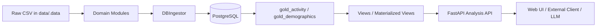

# Multi-domain Analytics

서로 다른 형식의 지역 데이터(매출, 유동인구, 격자 기반 통신 데이터, 성남시 서비스 데이터)를 하나의 공통 분석 스키마로 정규화하고, 비교 가능한 인사이트를 API로 제공하는 데이터 분석 플랫폼입니다.

배치 적재 엔진과 분석 API를 분리해 두었기 때문에, 새로운 도메인을 붙일 때 코어 분석 흐름을 크게 바꾸지 않고 확장할 수 있도록 설계했습니다. 이 프로젝트는 "이기종 데이터 통합", "분석용 데이터 모델링", "LLM 친화적 API 설계"를 함께 보여주기 위한 포트폴리오 성격이 강합니다.

## 한눈에 보기

- 여러 CSV 소스를 `gold_activity`, `gold_demographics` 공통 스키마로 통합
- PostgreSQL View / Materialized View 기반으로 실시간 지표와 배치 인사이트 계산
- 자연어 질의를 분석용 파라미터로 매핑하고 JSON 결과로 반환하는 FastAPI 서비스 제공
- 도메인 모듈 분리 구조로 신규 데이터 소스 확장 비용 최소화
- 선택적으로 Gemini 기반 질의 매핑, 요약 생성, 벡터 캐시를 결합

## 어떤 문제를 해결하는가

도메인별 데이터는 보통 아래 이유로 재사용이 어렵습니다.

- 컬럼 구조가 제각각이다
- 시간 단위가 월/일/격자 등으로 다르다
- 공간 식별 방식이 행정구역명, 코드, 좌표로 섞여 있다
- 분석 지표 정의가 데이터셋마다 다르다

이 프로젝트는 그 문제를 "도메인별 정규화 모듈 + 공통 적재 스키마 + 공통 분석 뷰" 조합으로 풀었습니다. 결과적으로 소스 데이터가 달라도 최종 소비자는 비슷한 형태의 질의와 결과 포맷으로 데이터를 다룰 수 있습니다.

## 핵심 기능

### 1. 이기종 데이터 정규화 배치

- `main.py`에서 CSV 파일을 읽어 도메인별 모듈로 정규화
- 지원 도메인:
  - 매출 데이터
  - 통신 유동 데이터
  - 격자 기반 통신 데이터
  - 성남시 서비스 계열 데이터
- 신규 파일만 적재하도록 ingest log 기반 멱등 처리
- 행정구역 매핑, 공간 라벨 보정, 지오 백필 흐름 포함

### 2. 공통 분석 스키마

- 활동량 계열 지표는 `gold_activity`
- 성/연령 분포는 `gold_demographics`
- 공간 메타데이터는 `dim_spatial`
- 날씨, 이벤트 등 확장 가능한 차원 테이블 구조 포함

이 구조 덕분에 "소스별 원본 컬럼" 대신 "분석용 공통 컬럼" 중심으로 후속 로직을 작성할 수 있습니다.

### 3. 분석 API와 툴형 엔드포인트

FastAPI 서버는 두 종류의 인터페이스를 제공합니다.

- 분석 API: 자연어 요청을 매핑한 뒤 비교, 랭킹, 이상치, 고급 인사이트를 조합해 반환
- Tool API: 명시적인 파라미터를 받아 바로 구조화 JSON 반환

주요 엔드포인트:

- `POST /api/analysis/compare`
- `POST /api/analysis/rankings`
- `POST /api/analysis/anomaly`
- `POST /api/analysis/advanced`
- `POST /api/analysis/report`
- `POST /api/tools/compare_domains`
- `POST /api/tools/get_rankings`
- `POST /api/tools/detect_anomaly`
- `POST /api/tools/get_advanced_insight`

보조 엔드포인트:

- `POST /mapping.json`: 자연어 질의를 분석 파라미터 JSON으로 변환
- `GET /dataset.json`: 적재 데이터 요약과 전역 인사이트 확인
- `GET /health.json`: LLM/외부 키 설정 상태 확인
- `GET /`: 간단한 분석 UI

### 4. LLM 친화적 분석 흐름

- 자연어 질의를 구조화된 분석 파라미터로 매핑
- 결과는 narrative보다 JSON 중심으로 반환
- 필요 시 Gemini로 요약 문장을 생성
- 질의 임베딩과 pgvector 캐시를 사용해 유사 요청 재사용 가능

즉, LLM이 DB에 직접 접근하지 않고도 분석 가능한 결과를 호출할 수 있는 얇은 어댑터 계층을 지향합니다.

## 아키텍처


```mermaid
flowchart LR
    A[Raw CSV in data/.data] --> B[Domain Modules]
    B --> C[DBIngestor]
    C --> D[(PostgreSQL)]
    D --> E[gold_activity / gold_demographics]
    E --> F[Views / Materialized Views]
    F --> G[FastAPI Analysis API]
    G --> H[Web UI / External Client / LLM]
```

### 배치 레이어

- `main.py`
- `services/db_ingest.py`
- `domain/*`

역할:

- 파일 패턴별 도메인 구분
- 청크 단위 CSV 처리
- 공통 테이블 upsert
- 선택적 Lake 저장(local / MinIO)

### 온라인 분석 레이어

- `app.py`
- `tools/mcp_tools.py`
- `tools/mcp_assistant.py`
- `services/llm_mapper.py`

역할:

- 자연어 질의 해석
- 분석 파라미터 보정
- View / MV 조회
- JSON 응답 및 선택적 요약 생성

### 저장소 레이어

- `db/init/001_schema.sql`: 기본 테이블
- `db/init/00x_views*.sql`: 분석용 View / MV
- `db/init/007_query_vector_cache.sql`: 질의 벡터 캐시

## 내가 이 프로젝트에서 집중한 부분

이 README를 채용 관점에서 읽는 사람에게 보여주고 싶은 포인트는 아래입니다.

- 데이터 모델링: 도메인별 원본 스키마를 공통 분석 스키마로 흡수
- 확장성: 신규 데이터셋 추가 시 도메인 모듈과 매핑 로직 위주로 확장
- 운영 안정성: 청크 적재, 파일 단위 중복 방지, 배치/온라인 흐름 분리
- 분석 서빙: SQL을 직접 노출하지 않고 의미 단위 API로 감싼 구조
- AI 연계: LLM을 결과 생성기가 아니라 질의 해석기와 요약 보조 계층으로 사용

## 기술 스택

| 구분 | 사용 기술 |
| --- | --- |
| Language | Python |
| API | FastAPI, Uvicorn |
| Data Processing | Pandas, GeoPandas, NumPy |
| Database | PostgreSQL, pgvector |
| Storage | Local filesystem, MinIO(S3 compatible) |
| Infra | Docker, Docker Compose |
| Lint/Test | Ruff, unittest |

## 실행 방법

### 1. 컨테이너 실행

```bash
docker-compose up --build -d
```

기본 서비스:

- `app`: FastAPI 서버
- `postgres`: PostgreSQL + pgvector
- `minio`: 선택적 lake storage

### 2. 데이터 적재

CSV 파일은 `data/` 또는 `.data/` 아래에 두고 아래 명령으로 적재합니다.

```bash
docker-compose run --rm app python main.py
```

기본 동작은 `MCP_MODE=db_ingest`입니다.

고급 인사이트 MV만 새로고침하려면:

```bash
docker-compose run --rm -e MCP_MODE=refresh_advanced_insights app python main.py
```

### 3. 서버 접속

- 웹 UI: [http://127.0.0.1:8000](http://127.0.0.1:8000)
- Swagger Docs: [http://127.0.0.1:8000/docs](http://127.0.0.1:8000/docs)
- 상태 확인: [http://127.0.0.1:8000/health.json](http://127.0.0.1:8000/health.json)

## 환경 변수

자주 쓰는 값만 정리했습니다.

| 변수 | 설명 |
| --- | --- |
| `MCP_DB_DSN` | PostgreSQL 연결 문자열 |
| `MCP_LLM_PROVIDER` | LLM provider, 현재 `gemini` 사용 가능 |
| `MCP_GEMINI_API_KEY` | 질의 매핑/요약용 Gemini API Key |
| `MCP_LAKE_TARGET` | lake 저장 대상, `local` 또는 `minio` |
| `MCP_LAKE_ROOT` | 로컬 lake 저장 경로 |
| `MCP_LAKE_S3_*` | MinIO/S3 저장 설정 |
| `MCP_SIG_SHAPEFILE` | 시군구 경계 보강용 shapefile |
| `MCP_EMD_SHAPEFILE` | 읍면동 매핑용 shapefile |
| `MCP_VWORLD_KEY` | 지오 백필용 VWORLD API Key |

## API 예시

### 자연어 기반 종합 리포트

```bash
curl -X POST http://127.0.0.1:8000/api/analysis/report \
  -F "q=강남구 2024-01 부터 2024-12 까지" \
  -F "domains=population,sales" \
  -F "include_summary=1"
```

### 명시적 파라미터 기반 랭킹 조회

```bash
curl -X POST http://127.0.0.1:8000/api/tools/get_rankings \
  -F "metric=sales" \
  -F "period=2024-12" \
  -F "top_k=10" \
  -F "level=sig"
```

## 프로젝트 구조

```text
.
├── app.py                  # FastAPI 서버, 분석/툴 엔드포인트
├── main.py                 # 배치 적재 및 MV 갱신 엔트리포인트
├── domain/                 # 도메인별 정규화 모듈
├── services/               # 적재, 요약, LLM 매핑, lake 저장
├── tools/                  # 분석 도구와 질의 매핑 보조 로직
├── db/init/                # 스키마, View, MV, 캐시 테이블 SQL
├── static/                 # 간단한 웹 UI
├── docs/                   # 질의 스키마, 프롬프트, API 문서
└── tests/                  # 핵심 도메인/인사이트 테스트
```

## 테스트

```bash
python -m unittest discover tests
```

## 문서

- [ARCHITECTURE.md](./ARCHITECTURE.md)
- [docs/mcp-tools.md](./docs/mcp-tools.md)
- [docs/query-schema.md](./docs/query-schema.md)

## 아쉬운 점과 다음 개선 방향

- 현재 Tool API에서 허용하는 도메인 값은 `population`, `sales` 중심이라 확장된 소스를 완전히 노출하지는 못합니다.
- 테스트 커버리지가 핵심 모듈 위주라, 적재 파이프라인과 API 레이어 통합 테스트 보강이 필요합니다.
- LLM 매핑은 실용적이지만 결정론적 규칙 기반 파서와의 역할 경계가 더 분명해질 여지가 있습니다.

그래도 구조적으로는 "데이터 파이프라인", "분석용 저장 모델", "API 서빙", "AI 연계 어댑터"를 한 저장소 안에서 일관되게 보여줄 수 있는 프로젝트입니다.
